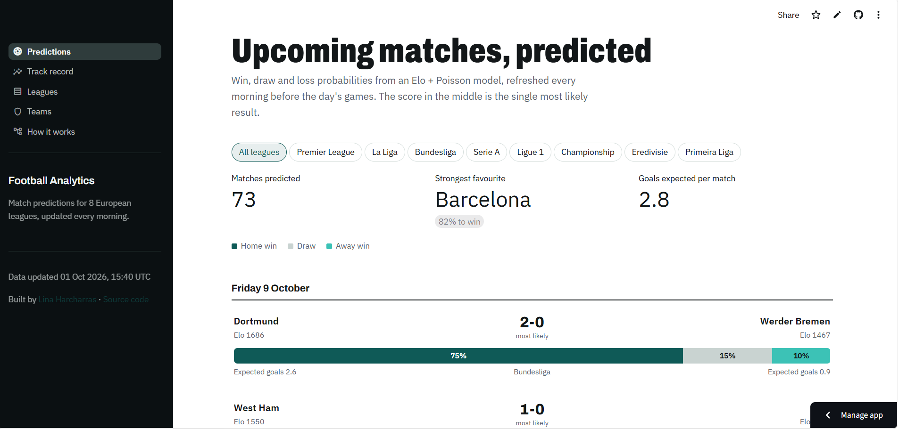
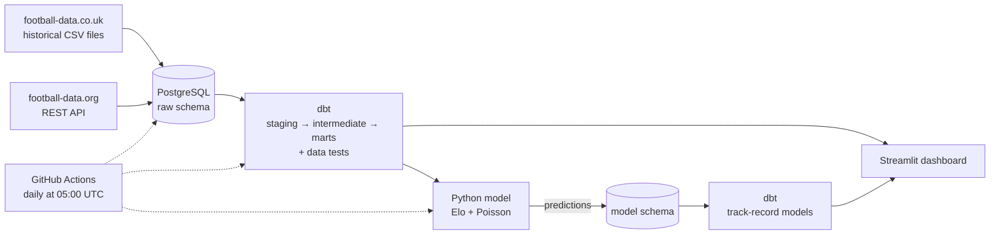
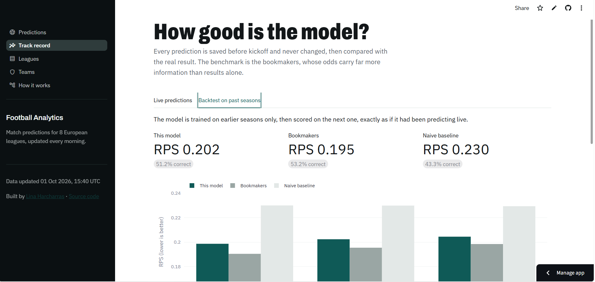

# ⚽ Football Analytics Pipeline & Match Predictor

[](https://github.com/linahrchrs/football-analytics-pipeline/actions/workflows/ci.yml)
[](https://github.com/linahrchrs/football-analytics-pipeline/actions/workflows/daily-pipeline.yml)
[](https://football-analytics-pipeline.streamlit.app/)

An end-to-end data project that collects football results from 8 European leagues every day, models them with dbt, predicts upcoming matches with an Elo + Poisson model, and publishes everything on a live dashboard.

Every prediction is saved **before kickoff** and never changed, then compared with the real result, so the model is judged on matches it could not have seen, against the toughest benchmark available: the bookmakers.

**👉 [Open the live dashboard](https://football-analytics-pipeline.streamlit.app/)**



---

## What it does

- **Collects** 32,000+ matches since 2015-16 from historical CSV files, plus fixtures and results of the current season from a REST API.
- **Reconciles** the two sources, which name teams differently, by learning the mapping from the data itself.
- **Models** the data with dbt into league tables, team form, home-advantage statistics and a unified match table, with tests on the football logic.
- **Rates** every team with Elo ratings that carry over between seasons and divisions.
- **Predicts** win, draw and loss probabilities, expected goals and the most likely score for every match in the next 10 days.
- **Evaluates** itself with a walk-forward backtest and a live track record, compared with bookmaker odds and a naive baseline.
- **Runs by itself** every morning on GitHub Actions, with tests on every push.

Leagues: Premier League, Championship, La Liga, Bundesliga, Serie A, Ligue 1, Eredivisie, Primeira Liga.

## Architecture



| Layer | Tools |
|---|---|
| Ingestion | Python, pandas, requests |
| Storage | PostgreSQL (Docker locally, Neon in production) |
| Transformation | dbt (staging, intermediate and mart models, generic and custom tests) |
| Modelling | scikit-learn (Poisson regression), SciPy, NumPy |
| Orchestration | GitHub Actions (daily pipeline and CI) |
| Dashboard | Streamlit, Plotly, deployed on Streamlit Community Cloud |
| Testing | pytest, dbt tests |

## Data pipeline

### Ingestion

- **Historical data**: one CSV file per league and season from football-data.co.uk, with results, match statistics (shots, corners, cards) and bookmaker odds. The loader handles the files' inconsistencies: two date formats, mixed encodings, columns missing in older seasons, blank rows and duplicate fixtures. Loads are idempotent upserts, so re-running never creates duplicates.
- **Current season**: fixtures and results from the football-data.org API, including matches not played yet. The client respects the free tier's rate limit and retries automatically.

### Reconciling the two sources

The two sources name teams differently ("Manchester United FC" vs "Man United", "Club Atlético de Madrid" vs "Ath Madrid"). Instead of a hand-written list, the mapping is **learned from the data**: a finished match appears in both sources with the same league, date and score, so each match is a vote that API team X is CSV team Y. Teams without enough votes fall back to fuzzy name matching, and uncertain pairs are flagged for review.

### dbt models

| Model | Purpose |
|---|---|
| `int_matches_unified` | One row per match from both sources: the CSV files are the reference for played matches, the API adds the latest results and every upcoming fixture |
| `int_team_matches` | One row per team per match, which turns team statistics into simple aggregations |
| `fct_matches` | Every match, with bookmaker probabilities (margin removed) as a benchmark |
| `fct_standings` | League table for every league and season |
| `fct_team_form` | Each team's form going *into* every match, computed only from earlier matches |
| `fct_league_seasons` | Home win, draw and away win rates and goals per league and season |
| `fct_prediction_results` | The last prediction made before each match, with the result and its score |
| `fct_team_ratings` | Current Elo rating and league rank of every team |

Besides standard tests (unique keys, accepted values, relationships), custom tests check the football logic: points always equal 3 × wins + draws, goals scored equal goals conceded in every league season, and no team plays twice on the same day, which would reveal a duplicate between the two sources.

## Prediction model

**Elo ratings.** Every team starts at 1500 and gains or loses points after each match, more for an unexpected result or a wide margin. Ratings are pulled slightly toward the average at the start of each season and carry over between divisions, so a promoted team keeps its strength. Elo is computed in Python rather than SQL because each rating depends on the previous one.

**Goals model.** Two Poisson regressions predict each team's expected goals from:
- the Elo difference, including home advantage,
- both teams' points from their last 5 matches,
- the league's average home and away goals the previous season.

The two expected-goal values give the probability of every scoreline, which add up to home win, draw and away win probabilities and the most likely score.

**No data leakage.** Every feature uses only information available before kickoff: Elo before the match, form from earlier matches, league averages from the previous season. Predictions are stored with a timestamp and never overwritten.

## Evaluation

The model is scored with a **walk-forward backtest**: for each of the last three completed seasons, it is trained on earlier seasons only and scored on that season, as if it had been predicting live. It is compared with:

- **Bookmakers**: odds converted to probabilities with the margin removed, a very strong benchmark since they also use team news, line-ups and market information.
- **Naive baseline**: the historical frequencies of home wins, draws and away wins.

The main metric is the **ranked probability score (RPS)**, the standard measure for football forecasts: it rewards confident correct probabilities and treats a draw as closer to a win than a loss is. Lower is better; 0 is perfect. Accuracy, log loss and Brier score are reported too.

Results over the 2023-24, 2024-25 and 2025-26 seasons (8,748 matches, all 8 leagues):

| Predictor | Accuracy | RPS ↓ | Log loss ↓ |
|---|---|---|---|
| **This model** | **51.2%** | **0.202** | **0.994** |
| Bookmakers | 53.2% | 0.195 | 0.971 |
| Naive baseline | 43.3% | 0.230 | 1.075 |

<details>
<summary>Season by season</summary>

| Season | Model RPS | Bookmakers RPS | Baseline RPS | Model accuracy | Bookmakers accuracy |
|---|---|---|---|---|---|
| 2023-24 | 0.1987 | 0.1905 | 0.2300 | 51.9% | 54.5% |
| 2024-25 | 0.2024 | 0.1955 | 0.2299 | 51.8% | 52.7% |
| 2025-26 | 0.2045 | 0.1985 | 0.2294 | 49.9% | 52.3% |

</details>

Using match results alone, the model closes about **80% of the gap** between the naive baseline and the bookmakers on RPS, and its accuracy is within 2 points of theirs. The remaining gap is the information bookmakers have and the model does not: injuries, line-ups, transfers and betting markets.

The live track record, updated every day, is on the [dashboard's Track record page](https://football-analytics-pipeline.streamlit.app/track-record).



## Dashboard

[football-analytics-pipeline.streamlit.app](https://football-analytics-pipeline.streamlit.app/)

- **Predictions**: upcoming matches with win, draw and loss probabilities, the most likely score and expected goals.
- **Track record**: live accuracy and RPS against the bookmakers, plus the backtest season by season.
- **Leagues**: tables for every league and season since 2015-16, with form and home-advantage trends.
- **Teams**: each team's Elo history, recent results and season-by-season record.
- **How it works**: the pipeline and the model in plain words.

## Automation and testing

- **Daily pipeline** (GitHub Actions, 05:00 UTC): current-season files → API → dbt build and tests → predictions → track-record models. It writes to a cloud PostgreSQL database (Neon) read by the dashboard.
- **CI** on every push: the full pytest suite against a temporary PostgreSQL service, covering parsing edge cases, idempotent loads, API rate-limit handling, the team-name mapping, Elo maths and the Poisson model. Database tests run in a separate test database.

## Run it locally

Requirements: Python 3.10+, Docker and a free [football-data.org](https://www.football-data.org) API key.

```bash
git clone https://github.com/linahrchrs/football-analytics-pipeline.git
cd football-analytics-pipeline
python -m venv venv && source venv/bin/activate        # Windows: venv\Scripts\activate
pip install -r requirements.txt
cp .env.example .env                                    # then add your API key
docker compose up -d                                    # PostgreSQL on localhost:5433

python -m src.ingestion.backfill_history                # history since 2015-16
python -m src.ingestion.backfill_history --current      # current season
python -m src.ingestion.fetch_api_matches               # fixtures and latest results
python -m src.ingestion.build_team_map                  # team-name mapping

cd dbt && dbt build --profiles-dir . --exclude tag:predictions && cd ..
python -m src.model.run all                             # Elo, backtest, predictions
cd dbt && dbt build --profiles-dir . --select tag:predictions && cd ..

streamlit run dashboard/app.py
pytest                                                  # tests
```

## Project structure

```
├── src/
│   ├── ingestion/          # CSV backfill, API client, team-name mapping
│   ├── model/              # Elo ratings, Poisson model, backtest and predictions
│   ├── db.py               # database connection and schema setup
│   └── dbt_env.py          # dbt connection settings from DATABASE_URL
├── dbt/
│   ├── models/             # staging, intermediate, marts, predictions
│   ├── seeds/              # team-name mapping, leagues
│   └── tests/              # football logic tests
├── dashboard/              # Streamlit app
├── sql/init/               # raw and model schemas
├── tests/                  # pytest suite
├── .github/workflows/      # CI and daily pipeline
└── docker-compose.yml
```

## Limitations and next steps

- The model only sees results: no injuries, line-ups or transfers, which is where bookmakers have the edge.
- Independent Poisson distributions slightly underestimate draws; a Dixon-Coles correction would address this.
- Ideas: add shots and expected-goals data as features, calibrate probabilities, and cover more leagues.

## Data sources

- [football-data.co.uk](https://www.football-data.co.uk): historical results, statistics and odds.
- [football-data.org](https://www.football-data.org): fixtures and results API.

## Author

**Lina Harcharras**, Data Science & Machine Learning · [Portfolio](https://linahrchrs.github.io) · [LinkedIn](https://www.linkedin.com/in/lina-harcharras/) · [GitHub](https://github.com/linahrchrs)